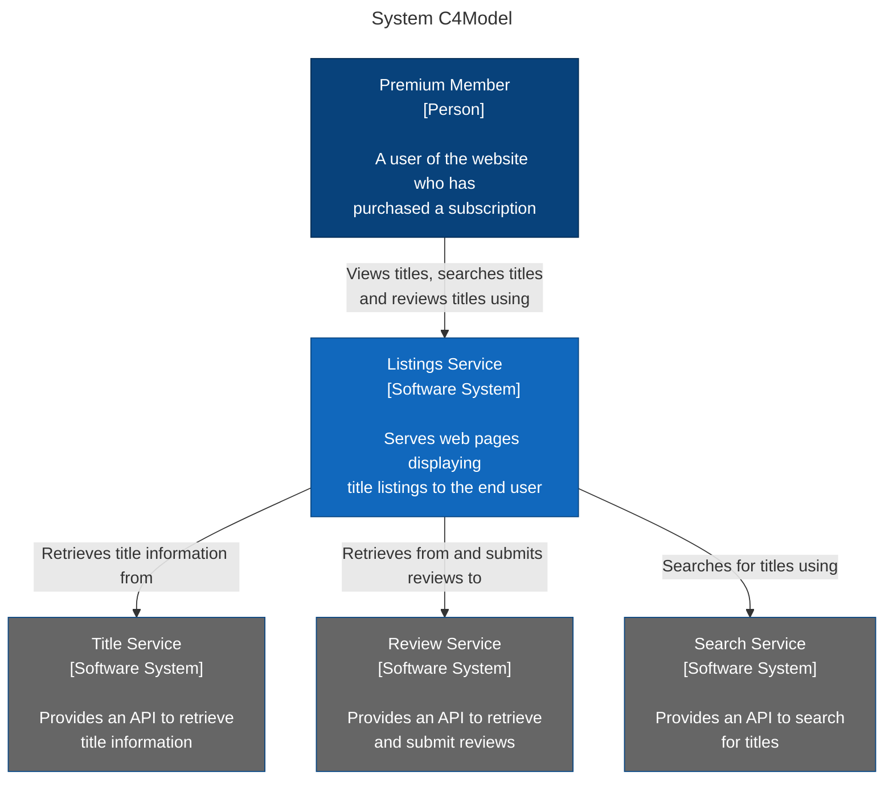
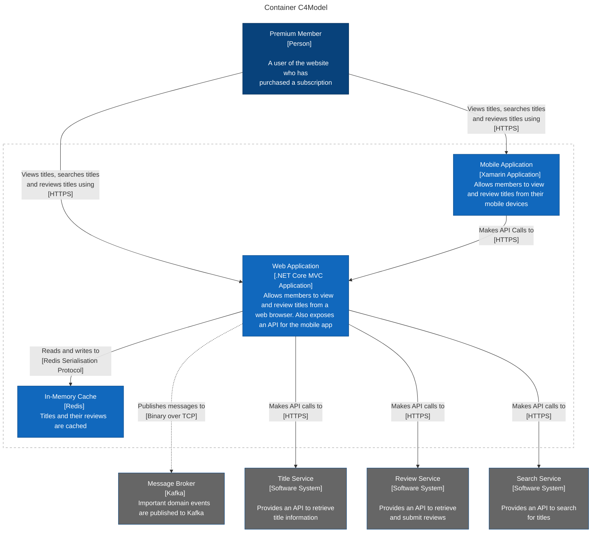

# Flowcharts

```mermaid
---
title: "System C4Model"
---
flowchart TD
    User["Premium Member
    [Person]
    
    A user of the website who has\npurchased a subscription"]

    LS["Listings Service
    [Software System]
    
    Serves web pages displaying\ntitle listings to the end user"]

    TS["Title Service
    [Software System]
    
    Provides an API to retrieve\ntitle information"]

    RS["Review Service
    [Software System]
    
    Provides an API to retrieve\nand submit reviews"]

    SS["Search Service
    [Software System]
    
    Provides an API to search\nfor titles"]

    User-- "Views titles, searches titles\nand reviews titles using" -->LS

    LS-- "Retrieves title information from" -->TS
    LS-- "Retrieves from and submits reviews to" -->RS
    LS-- "Searches for titles using" -->SS

    %% Styling
    classDef focusSystem fill:#1168bd,stroke:#0b4884,color:#ffffff
    classDef supportingSystem fill:#666666,stroke:#0b4884,color:#ffffff
    classDef person fill:#08427b,stroke:#052e56,color:#ffffff

    class User person
    class LS focusSystem
    class TS,RS,SS supportingSystem
```

```mermaid
---
title: "Container C4Model"
---
flowchart TD
    User["Premium Member
    [Person]
    
    A user of the website who has\npurchased a subscription"]

    WA["Web Application
    [.NET Core MVC Application]
    Allows members to view and review titles from a web browser. Also exposes an API for the mobile app"]

    MA["Mobile Application
    [Xamarin Application]
    Allows members to view and review titles from their mobile devices"]

    R["In-Memory Cache
    [Redis]
    Titles and their reviews are cached"]

    K["Message Broker
    [Kafka]
    Important domain events are published to Kafka"]

    TS["Title Service
    [Software System]
    
    Provides an API to retrieve\ntitle information"]

    RS["Review Service
    [Software System]
    
    Provides an API to retrieve\nand submit reviews"]

    SS["Search Service
    [Software System]
    
    Provides an API to search\nfor titles"]

    User-- "Views titles, searches titles\nand reviews titles using
    [HTTPS]" -->WA

    User-- "Views titles, searches titles\nand reviews titles using
    [HTTPS]" -->MA

    subgraph listing-service[Listing Service]
        MA-- "Makes API Calls to\n[HTTPS]" -->WA

        WA-- "Reads and writes to\n[Redis Serialisation Protocol]" -->R
        %%MA
    end

    WA-. "Publishes messages to\n[Binary over TCP]" ..->K
    WA-- "Makes API calls to\n[HTTPS]" --->TS
    WA-- "Makes API calls to\n[HTTPS]" --->RS
    WA-- "Makes API calls to\n[HTTPS]" --->SS

    %% Styling
    classDef container fill:#1168bd,stroke:#0b4884,color:#ffffff
    classDef person fill:#08427b,stroke:#052e56,color:#ffffff
    classDef supportingSystem fill:#666666,stroke:#0b4884,color:#ffffff

    class User person
    class WA,MA,R container
    class TS,K,RS,SS supportingSystem

    style listing-service fill:none,stroke:#CCCCCC,stroke-width:2px
    style listing-service color:#FFFFFF,stroke-dasharray: 5 5,stroke-width:2px
```
