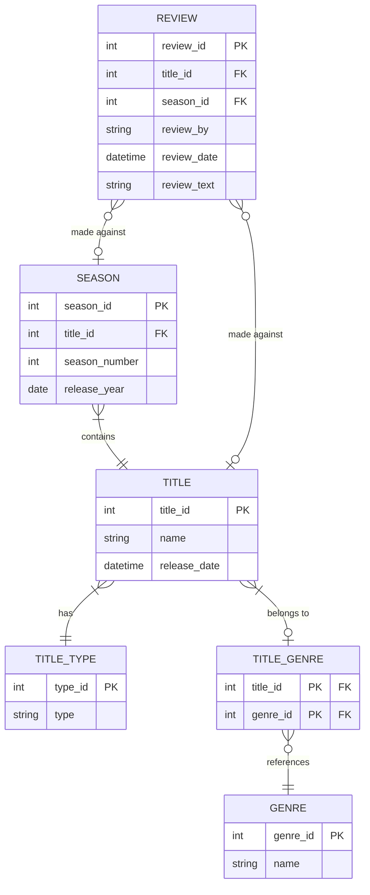

# Entity Diagram

---
title: Entity Diagram
---

```mermaid
erDiagram
    TITLE {
        int title_id PK
        string name
        datetime release_date
    }
    TITLE_TYPE {
        int type_id PK
        string type
    }
    GENRE {
        int genre_id PK
        string name
    }
    TITLE_GENRE {
        int title_id PK "FK"
        int genre_id PK "FK"
    }
    SEASON {
        int season_id PK
        int title_id FK
        int season_number
        date release_year
    }
    REVIEW {
        int review_id PK
        int title_id FK
        int season_id FK
        string review_by
        datetime review_date
        string review_text
    }

    TITLE }|--|| TITLE_TYPE: has
    TITLE }|--o| TITLE_GENRE: "belongs to"
    TITLE_GENRE }o--|| GENRE: references
    SEASON }|--|| TITLE: contains
    REVIEW }o--o| TITLE: "made against"
    REVIEW }o--o| SEASON: "made against"
```
