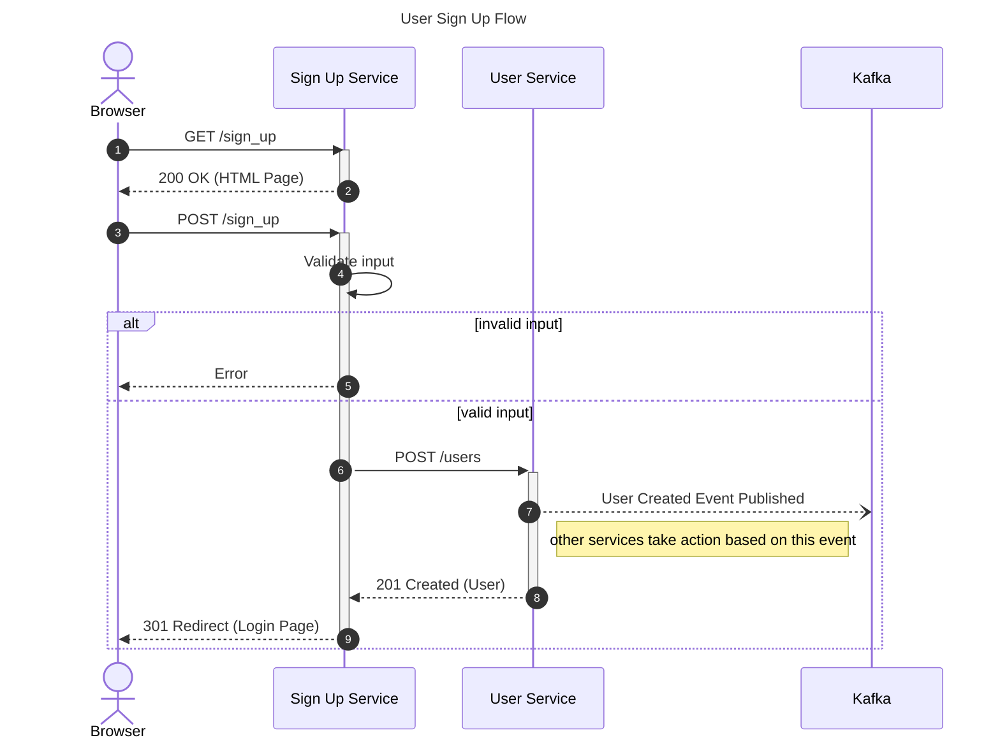

# User Flow

## Key
### Synchornous Calls
`->>` Request

`-->>` Response

### Asynchornous Calls
`--)` Request

```mermaid
---
title: User Sign Up Flow
---
sequenceDiagram
    autonumber
    actor Browser
    participant SUS as Sign Up Service
    participant US as User Service
    links US: {"Responsitory": "#"}
    participant Kafka

    Browser->>SUS: GET /sign_up
    activate SUS
    SUS-->>Browser: 200 OK (HTML Page)
    deactivate SUS

    Browser->>+SUS: POST /sign_up
    SUS->>SUS: Validate input

    alt invalid input
        SUS-->>Browser: Error
    else valid input
        SUS->>+US: POST /users
        US--)Kafka: User Created Event Published
        Note left of Kafka: other services take action based on this event
        US-->>-SUS: 201 Created (User)
        SUS-->>-Browser: 301 Redirect (Login Page)
    end

```
